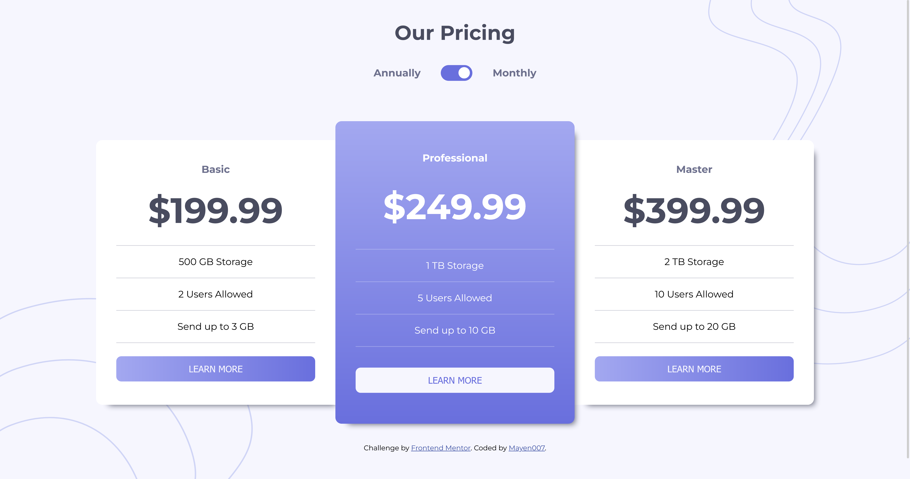

# Frontend Mentor - Pricing Component with Toggle Solution

This is a solution to the [Pricing component with toggle challenge on Frontend Mentor](https://www.frontendmentor.io/challenges/pricing-component-with-toggle-8vPwRMIC). Frontend Mentor challenges help you improve your coding skills by building realistic projects.

## Table of Contents

- [Overview](#overview)
  - [The Challenge](#the-challenge)
  - [Screenshot](#screenshot)
  - [Links](#links)
- [My Process](#my-process)
  - [Built With](#built-with)
  - [What I Learned](#what-i-learned)
  - [Continued Development](#continued-development)
  - [Useful Resources](#useful-resources)
- [Author](#author)

---

## Overview

### The Challenge

Users should be able to:

- View the optimal layout for the component depending on their device's screen size.
- Control the toggle with both their mouse/trackpad and keyboard.
- **Bonus**: Complete the challenge using just HTML and CSS (optional).

### Screenshot



This screenshot shows the final solution with both monthly and annual pricing states.

### Links

- **Solution URL**: [View my solution](#)
- **Live Site URL**: [Visit live site](#)

---

## My Process

### Built With

- Semantic HTML5 markup
- CSS custom properties
- Flexbox
- CSS Grid
- JavaScript for toggle functionality
- Mobile-first workflow

### What I Learned

While building this project, I refined my skills in:

1. **Responsive Design**:

   - Using CSS Grid and Flexbox to create a layout that adapts well across different screen sizes.

2. **Accessible Toggle Design**:
   - Implemented a toggle with support for both mouse and keyboard interactions.
   - Added `aria-checked` for better screen reader support.

Here's a code snippet demonstrating the toggle functionality:

```javascript
const toggle = document.getElementById("pricing-toggle");
toggle.addEventListener("change", function () {
  const isMonthly = this.checked;
  document.getElementById("basic-price").textContent = isMonthly
    ? "$19.99"
    : "$199.99";
});
```

3. **CSS Variables**:
   - Leveraged CSS variables for consistent theming across the component.

```css
:root {
  --neutral-very-light-grayish-blue: hsl(240, 78%, 98%);
  --neutral-light-grayish-blue: hsl(234, 14%, 74%);
}
```

### Continued Development

In future projects, I aim to:

- Explore more advanced accessibility techniques to ensure all users can navigate my solutions effortlessly.
- Focus on improving performance by optimizing CSS and JavaScript.
- Incorporate modern front-end libraries like React for more dynamic components.

### Useful Resources

- [MDN Web Docs](https://developer.mozilla.org/) - Comprehensive resource for web development.
- [The Markdown Guide](https://www.markdownguide.org/) - Helped structure this README effectively.
- [Frontend Mentor Community](https://www.frontendmentor.io/) - A great place to get feedback and learn from others.

---

## Author

- Frontend Mentor - [@Mayen007](https://www.frontendmentor.io/profile/Mayen007)
- GitHub - [Mayen007](https://github.com/Mayen007)
